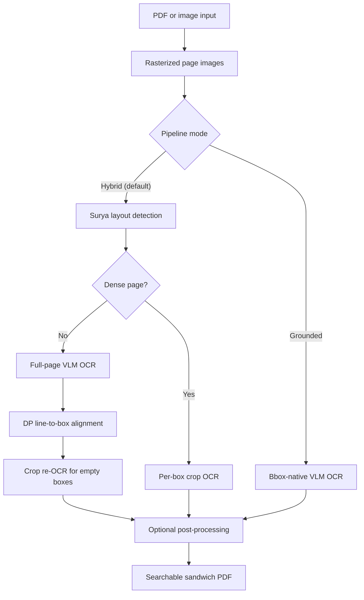

# Local LLM PDF OCR

[](https://python.org)
[](https://fastapi.tiangolo.com)
[](LICENSE)

Turn scanned PDFs and images into searchable, selectable PDFs with a vision language model (VLM). The default setup uses a local OpenAI-compatible endpoint such as [LM Studio](https://lmstudio.ai), so document content stays on your machine.

## Features

- Accepts PDFs and raw images: JPEG, PNG, BMP, WebP, TIFF, and AVIF.
- Expands multi-frame TIFF files into multi-page output PDFs.
- Produces sandwich PDFs with the original page image and an invisible text layer.
- Supports a hybrid OCR path for plain-text VLMs and a grounded path for bbox-native VLMs.
- Detects dense pages and switches them to focused per-box OCR automatically.
- Includes a FastAPI web workspace with upload, live progress, text preview, translation, structured extraction, runtime settings, and recent job history.
- Supports local OpenAI-compatible servers and LiteLLM provider-prefixed cloud models.
- Validates loaded models before local OCR to catch LM Studio's silent fallback behavior.

## Architecture

The shared `OCRPipeline` has two execution paths.



### Hybrid path

The default path uses Surya for detection only. A VLM transcribes sparse pages, then a Needleman-Wunsch-style dynamic-programming aligner maps text lines to normalized Surya boxes. Empty text boxes can be cropped and re-OCR'd individually. Pages with more than 60 detected boxes use per-box OCR by default because focused crops are more reliable on dense handwriting and complex layouts.

### Grounded path

`--grounded` uses a bbox-native VLM such as Qwen2.5-VL or Qwen3-VL. The model returns text and pixel coordinates in one response per page. This path skips Surya, DP alignment, and refine OCR.

## Requirements

- Python 3.11 or newer
- [`uv`](https://docs.astral.sh/uv/)
- An OpenAI-compatible VLM endpoint

The default endpoint is LM Studio at `http://localhost:1234/v1` with `allenai/olmocr-2-7b`.

Surya downloads its detection model from Hugging Face Hub on the first hybrid run. The grounded path does not load Surya.

## Installation

### macOS and Linux

```bash
git clone https://github.com/Sifr-r/local-llm-pdf-ocr.git
cd local-llm-pdf-ocr
uv sync
```

Install the web dependencies when you need the server:

```bash
uv sync --extra web
```

The base install includes the CLI and shared OCR pipeline. The web server is an
optional boundary: `local-llm-pdf-ocr-server` is always installed, but it only
loads FastAPI and Uvicorn when the server is started.

Install the asynchronous translation dependencies only when you need the
Redis/Celery/LangGraph background translation API:

```bash
uv sync --extra web --extra async-translation
```

### Windows

Double-click `install.bat`. It runs `install.ps1`, installs `uv` when needed, syncs the web environment, checks for Docker, and creates Desktop and Start Menu shortcuts.

The generated launcher attempts to start Redis, a Celery worker, and the web server before opening `http://localhost:8000`. Redis and Celery are only needed for the optional asynchronous LangGraph translation API.

## Configuration

Create a `.env` file in the repository root:

```env
LLM_API_BASE=http://localhost:1234/v1
LLM_API_KEY=lm-studio
LLM_MODEL=allenai/olmocr-2-7b
```

The CLI accepts per-run overrides. The web server also reads these optional environment variables:

```env
OCR_CONCURRENCY=3
OCR_DPI=200
OCR_DENSE_MODE=auto
OCR_DENSE_THRESHOLD=60
OCR_MAX_IMAGE_DIM=1024
OCR_REFINE=1
OCR_VERIFY_MODEL=1
OCR_PIPELINE_MODE=hybrid
OCR_SELF_CORRECTION=0
OCR_BINARIZE=0
OCR_DUAL_ENGINE=0
OCR_SPELLCHECK=none
OCR_CROSS_PAGE=0
ALLOW_SSRF_LOCAL=true
REDIS_URL=redis://localhost:6379/0
```

`ALLOW_SSRF_LOCAL=true` is the default because local LM Studio and Ollama endpoints are the primary use case. Set it to `false` when exposing the web server to untrusted users; private, loopback, link-local, multicast, and internal metadata targets will then be rejected.

## CLI Usage

```bash
uv run local-llm-pdf-ocr input.pdf
uv run local-llm-pdf-ocr scan.png scan_ocr.pdf
uv run local-llm-pdf-ocr archive.tiff archive_ocr.pdf
```

The output argument is optional and defaults to `<input_stem>_ocr.pdf`.

| Option | Description |
| --- | --- |
| `-v`, `--verbose` | Enable debug logging. |
| `-q`, `--quiet` | Suppress output except errors. |
| `--dpi <int>` | Rendering DPI. Default: `200`. |
| `--pages <range>` | Process a 1-indexed range such as `1-3,5`. |
| `--concurrency <int>` | Maximum parallel LLM calls. Default: `1`. |
| `--no-refine` | Disable crop re-OCR for empty aligned boxes. |
| `--max-image-dim <int>` | Cap the longest page edge sent to the VLM. Default: `1024`. |
| `--dense-mode {auto,always,never}` | Select per-box OCR automatically, always, or never. |
| `--dense-threshold <int>` | Dense-page box threshold for `auto`. Default: `60`. |
| `--grounded` | Use bbox-native grounded OCR. |
| `--api-base <url>` | Override the LLM base URL. |
| `--api-key <key>` | Supply an API key for cloud or protected endpoints. |
| `--model <name>` | Override the model name. |
| `--no-verify-model` | Skip `GET /v1/models` pre-flight validation. |

Examples:

```bash
# Select pages and increase rendering DPI
uv run local-llm-pdf-ocr document.pdf output.pdf --pages 1-5 --dpi 300

# Ollama with a smaller image cap
uv run local-llm-pdf-ocr scan.pdf \
  --api-base http://localhost:11434/v1 \
  --model glm-ocr:latest \
  --max-image-dim 640 \
  --no-verify-model

# Grounded bbox-native OCR
uv run local-llm-pdf-ocr scan.pdf --grounded --model qwen/qwen3-vl-8b

# Focused OCR for every detected text box
uv run local-llm-pdf-ocr notes.pdf --dense-mode always --concurrency 5
```

The advanced enhancement settings described below are currently exposed by the web workspace and `OCRPipeline`, not as CLI flags.

## Web Workspace

Install the web dependencies and start the FastAPI server:

```bash
uv sync --extra web
uv run local-llm-pdf-ocr-server --port 8000
```

Open `http://localhost:8000`. The workspace supports PDF and image uploads up to 100 MB, hybrid and grounded OCR, page selection, live WebSocket progress, downloadable PDFs, text and Markdown export, translation, structured JSON extraction, and an in-memory recent-job list capped at 50 entries.

The workspace exposes additional OCR enhancement settings:

| Setting | Behavior |
| --- | --- |
| Self correction | Sends a second image-aware correction request after OCR. |
| Binarize | Applies adaptive thresholding before OCR. |
| Dual engine | Uses a local Tesseract draft as a VLM hint when `pytesseract` and Tesseract language data are available. |
| Spellcheck | Runs conservative dictionary-based post-processing for the selected language. |
| Cross-page merge | Merges a non-terminated final line into the next page's first line. |

Translation and structured extraction in the browser use synchronous LiteLLM-backed endpoints and do not require Redis. The optional asynchronous translation API uses Celery, Redis, and the LangGraph workflow, so install both optional extras before running the worker:

```bash
docker run -d --name redis-local-ocr -p 6379:6379 redis
uv run --extra web --extra async-translation celery -A pdf_ocr.api.celery_app worker --loglevel=info -P solo
```

## HTTP API

| Method | Path | Purpose |
| --- | --- | --- |
| `GET` | `/` | Serve the web workspace. |
| `POST` | `/process` | Upload and OCR a PDF or supported image. |
| `GET` | `/text/{job_id}` | Fetch extracted page text for a completed job. |
| `GET` | `/api/config` | Read runtime web configuration with masked API key. |
| `POST` | `/api/config` | Update accepted runtime configuration keys. |
| `GET` | `/api/models` | List models from the configured endpoint. |
| `GET` | `/api/jobs` | List recent in-memory jobs. |
| `DELETE` | `/api/jobs` | Clear recent jobs and saved text payloads. |
| `POST` | `/api/translate` | Translate OCR text synchronously. |
| `POST` | `/api/extract` | Extract invoice, resume, academic, or custom JSON data. |
| `POST` | `/api/translate/async` | Queue LangGraph translation with Celery. |
| `GET` | `/api/translate/status/{job_id}` | Poll a queued translation. |
| `WS` | `/ws/{client_id}` | Receive OCR progress events. |

## Project Layout

```text
src/pdf_ocr/
  cli.py                  CLI entry point
  server.py               FastAPI application
  pipeline.py             Shared hybrid and grounded orchestration
  evaluation.py           Ground-truth comparison helpers
  api/
    routers/              OCR, configuration, and WebSocket routes
    celery_app.py         Optional Redis-backed Celery application
    tasks.py              Optional background translation task
  core/
    aligner.py            Surya detection and DP alignment
    grounded.py           Grounded backends and JSON parsing
    ocr.py                LiteLLM OCR client and stability filters
    pdf.py                PDF/image conversion and text embedding
    postprocess.py        Dictionary spellcheck
    translation_config.py Typed async translation settings
    translation.py        LangGraph translation workflow
  resources/dictionaries/ Packaged spellcheck dictionaries
  static/                 Browser workspace assets
  utils/
    image.py              Crop and blank-region helpers
    litellm_provider.py   LiteLLM provider selection
    security.py           SSRF target validation
tests/                    Fast tests and slow Surya integration tests
scripts/                  Evaluation, fixture, and debugging utilities
examples/                 Example inputs and generated outputs
resources/                Legacy spellcheck dictionary fallback and Tesseract wordlists
```

## Testing

```bash
uv run pytest
uv run pytest -m "not slow"
uv run pytest -m slow
uv run pytest tests/test_aligner.py -v
```

Slow tests load Surya and run against the example PDFs. The first slow run can download the Surya model. `pytest-asyncio` runs in auto mode, so asynchronous tests do not need decorators.

Run quality checks with:

```bash
uv run ruff check src tests
uv run ruff format src tests --check
uv run mypy src
```

Run confidence evaluation against the ground-truth fixtures with a live VLM endpoint:

```bash
uv run scripts/confidence_eval.py --path both \
  --grounded-model qwen/qwen3-vl-8b \
  --hybrid-model allenai/olmocr-2-7b
```

## Notes

- Bounding boxes are normalized as `[x0, y0, x1, y1]` in `0..1` until PDF embedding.
- `--no-verify-model` is useful for servers that do not implement `/v1/models` or that load models on demand.
- Lower `--max-image-dim` if a small local VLM exceeds its context size or becomes unstable.
- Dual-engine OCR gracefully falls back to VLM-only behavior when Tesseract is unavailable.

## License

MIT
